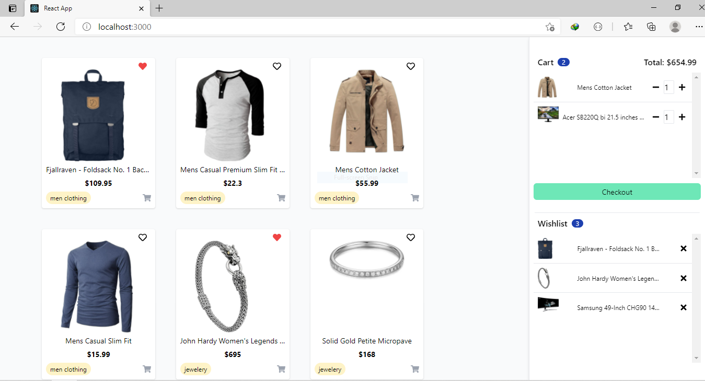

# Product Store


Simple product store built with React and Tailwind CSS.

## Features
- View products list
- Add/remove product to cart
- Add/remove product to wishlist


Running the app.

```sh
npm run start
```

## Implementation
- Uses context hook to share states with all components.
- Uses reducer hook to manage app leve state.
- Uses state hook to manage component level state.
- Uses portal to show toaster messages.
 
## Screenshot




## License

MIT
